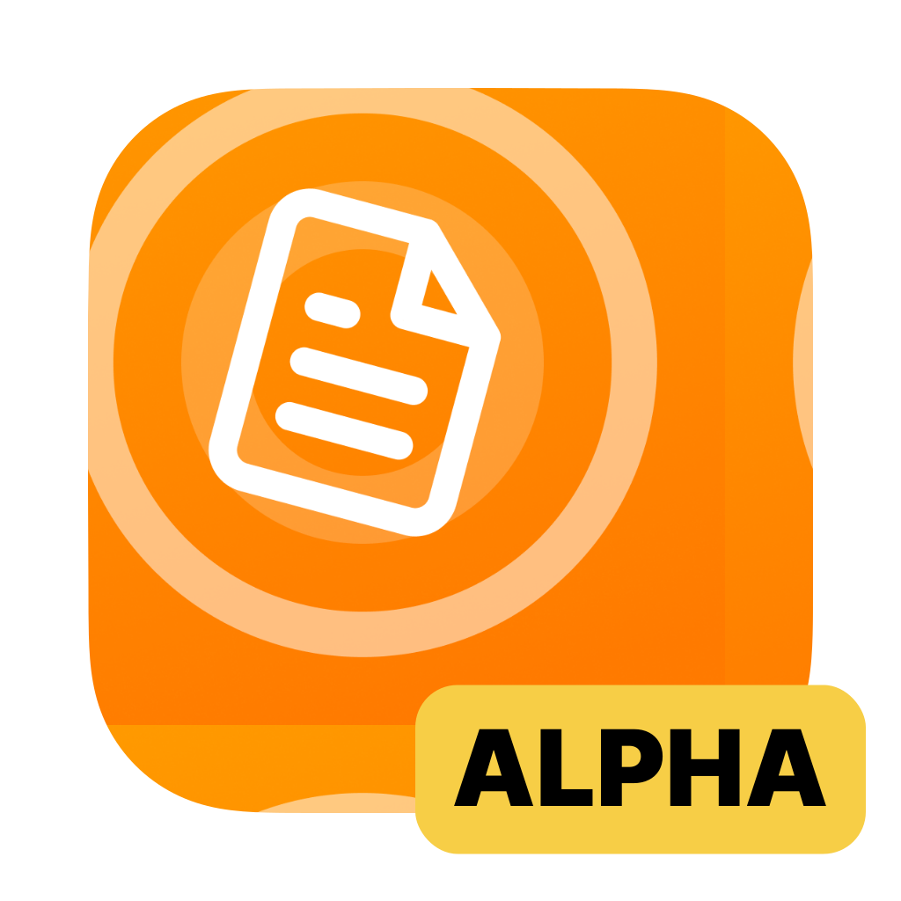
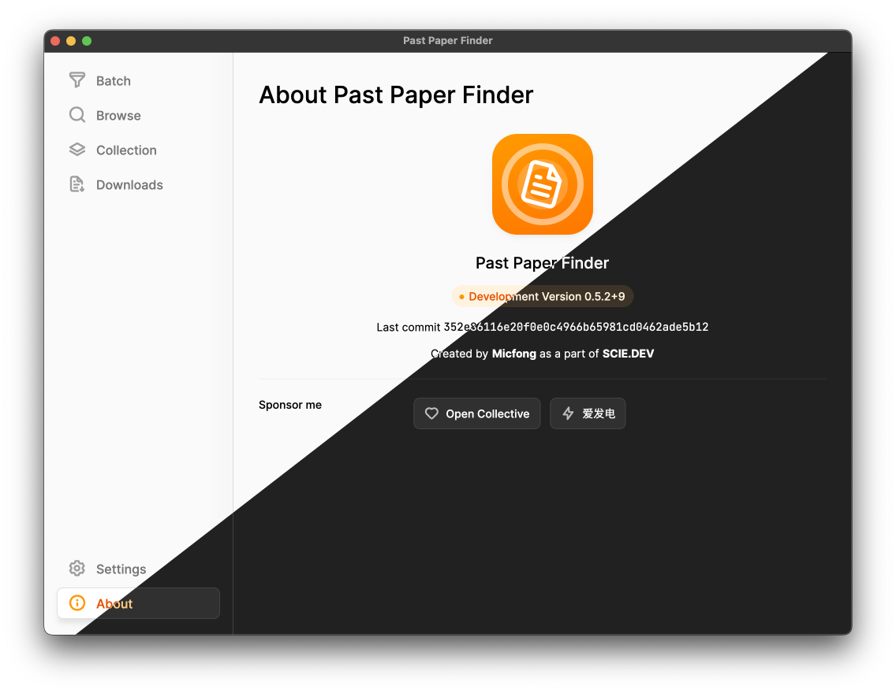
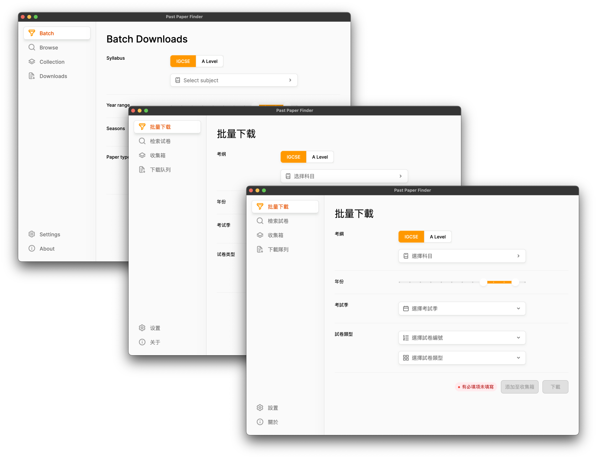

# 📦 Archiving This Repository 📦

On Dec 12 2022, we archived this repository since we are now working on a refactored and extended version of Past Paper Finder: Past Paper Master. It is now under active private development within SCIE.DEV and will *hopefully* enter public test in early 2023. Stay tuned!

---

<h1>Past Paper Finder</h1>

Past Paper Finder is a past paper downloader for IGCSE and A-Level. It is designed to be as simple as possible and easy to use.

## Features

- **Batch Download**:
  Download multiple past papers with a single click. You can filter with subject, year range, paper numbers, and paper types.
- **Browse Papers**:
  Browse past papers by directory, without requiring internet connection.
- **Collection**:
  Collect sets of past papers and download them all at once.

## Downloads

You may download Past Paper Finder from the [official website](https://pastpaperfinder.vercel.app/), or you can build from source as well ;)

### Supported platforms

| Supported Platform | Latest Version  |
| ------------------ | --------------- |
| Windows            | 0.7.2+15        |
| macOS              | 0.7.2+15        |
| Linux              | Coming soon     |
| iPadOS             | Coming soon     |
| Android            | Coming soon     |
| *iOS (for iPhone)* | *Not planned\** |

*iOS support is currently not planned because this is a batch **file** downloader, and would be inappropriate for a mobile phone to work on. Although support for this platform is technically feasible, it would require a lot of effort in optimizing UI for its extremely small screen.

## Screenshots

## Sponsor

Although I hate to talk about this section, I'm extremely grateful you're considering supporting me. The developer is currently a high school student, so does not have financial resources to pay for hosting (especially for App Store submissions). Therefore, any support is greatly appreciated.

If you are not in China mainland, you can also sponsor me using [Patreon](https://patreon.com/Micfong).

## License

This software is under the [MIT license](LICENSE).
